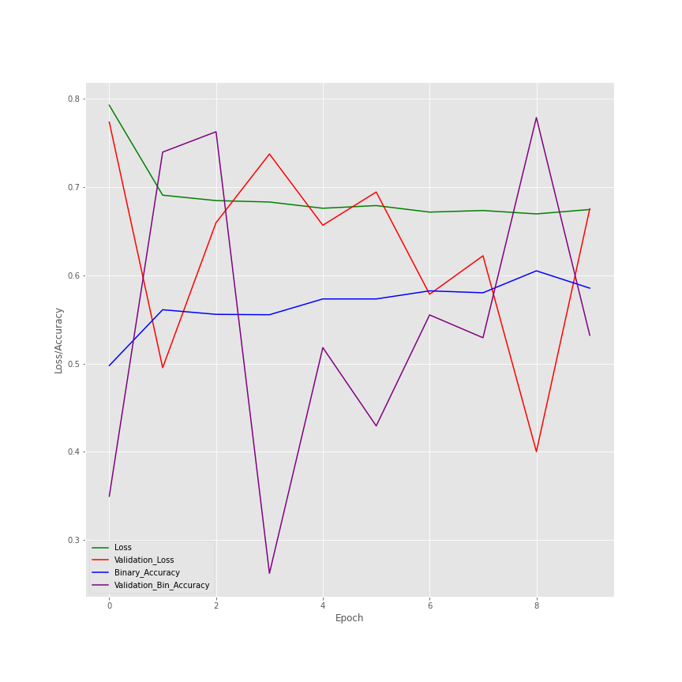
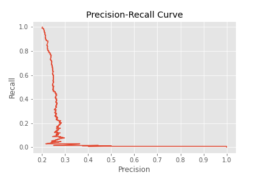

# FDA  Preparation

**Your Name:**  Elliot Y.

**Name of your Device:**  Machine Learning Model for Pneumonia Detection on Chest X-Rays 

## Algorithm Description 

### 1. General Information

**Intended Use Statement:**  This algorithm is comprised of a Convolutional Neural Network model to analyze Chest X-Ray images to detect the presence of pneumonia.  It is intended to assist radiologists in the clinical setting and should be used in conjunction with a Radiologist's review of the Xray, sputnum cultures, and a review of a patient's medical history for diagnostic validation.

**Indications for Use:**  This algorithm may be applied to patients who's medical history may indicate pneumonia infection, of ages 1 thru 95 and of gender Male or Female. X-Ray images must be taken with a PA or AP viewing position.

**Device Limitations:**  This algorithm must be run with a computer that meet minimum GPU and RAM requirements.  
Furthermore, presence of Infiltration may confound device performance.  Infiltration may cause the device to classify an X-Ray image as Positive Pneumonia.

**Clinical Impact of Performance:** 
The goal of this device is assist Radiologists with their review of X-Rays for indications of Pneumonia.  A Radiologist is required to review all X-Rays and validate results. When this device incorrectly predicts a False Positive, a patient may be directed for a sputnum culture and the diagnosis can be validated with the sputnum culture.   
On the other hand, a False Negative can adversely impact a patient.  If the False Negative is not revised by a Radiologist, a clinician may proceed with an incorrect diagnosis and not proceed to sputnum cultures.
 Therefore, it is critical for Radiologists to review and validate all results.

### 2. Algorithm Design and Function

**DICOM Checking Steps:**
 Check DICOM Headers for: 
 Modality == 'DX'
 BodyPartExamined=='CHEST'
 PatientPosition in 'PA' or'AP' Position
 If any of these three categories do not match their respective requirements, 
then a message will state that the DICOM does not meet criteria. 

**Preprocessing Steps:**
 For DICOMs that pass the intial Header check, the DICOM pixel array will be opened.
A copy of the DICOM pixel array will be normalized and then resized to 224 by 224 pixels.

**CNN Architecture:**

A Sequential Model was built by Fine-tuning the VGG16 Model with ImageNet weights.
 This model takes the VGG16 model layers up to and including the block5_pool.   Layers taken from the VGG16 model were frozen, so that their weights were not trained.  Output from this pre-trained model was flattened.
 These following layers were added:
 (Dense(1024, activation = 'relu'))
 (Dropout(0.5))
 (Dense(512, activation = 'relu'))
 (Dropout(0.5))
 (Dense(256, activation = 'relu'))
 (Dropout(0.5))
 (Dense(1, activation = 'sigmoid'))
 Output

#### Full Model architecture:
#### Layer (type)                         Output Shape                         Parameter #        
------------------------------------------------------------------------
input_5 (InputLayer)         (None, 224, 224, 3)       0         
block1_conv1 (Conv2D)        (None, 224, 224, 64)      1792      
block1_conv2 (Conv2D)        (None, 224, 224, 64)      36928     
block1_pool (MaxPooling2D)   (None, 112, 112, 64)      0         
block2_conv1 (Conv2D)        (None, 112, 112, 128)     73856     
block2_conv2 (Conv2D)        (None, 112, 112, 128)     147584    
block2_pool (MaxPooling2D)   (None, 56, 56, 128)       0         
block3_conv1 (Conv2D)        (None, 56, 56, 256)       295168    
block3_conv2 (Conv2D)        (None, 56, 56, 256)       590080    
block3_conv3 (Conv2D)        (None, 56, 56, 256)       590080    
block3_pool (MaxPooling2D)   (None, 28, 28, 256)       0         
block4_conv1 (Conv2D)        (None, 28, 28, 512)       1180160   
block4_conv2 (Conv2D)        (None, 28, 28, 512)       2359808   
block4_conv3 (Conv2D)        (None, 28, 28, 512)       2359808   
block4_pool (MaxPooling2D)   (None, 14, 14, 512)       0         
block5_conv1 (Conv2D)        (None, 14, 14, 512)       2359808   
block5_conv2 (Conv2D)        (None, 14, 14, 512)       2359808   
block5_conv3 (Conv2D)        (None, 14, 14, 512)       2359808   
block5_pool (MaxPooling2D)   (None, 7, 7, 512)         0      
flatten_4 (Flatten)          (None, 25088)             0         
dense_15 (Dense)             (None, 1024)              25691136  
dropout_12 (Dropout)         (None, 1024)              0         
dense_16 (Dense)             (None, 512)               524800    
dropout_13 (Dropout)         (None, 512)               0         
dense_17 (Dense)             (None, 256)               131328    
dropout_14 (Dropout)         (None, 256)               0         
dense_18 (Dense)             (None, 1)                 257  

### 3. Algorithm Training

**Parameters:** 

Keras.preprocessing.image ImageDataGenerator was used with the following parameters to augment training images.    my_train_idg = ImageDataGenerator(rescale = 1./255,
                                  horizontal_flip = True,
                                  height_shift_range = 0.1,
                                  width_shift_range = 0.1,
                                  rotation_range = 15,
                                  shear_range = 0.1,
                                  zoom_range = 0.1, 
                                  samplewise_center = True,
                                  samplewise_std_normalization = True
                                  )

The Image Data Generator was applied to the training data.  The training data was resized to 224x224 and divided into batch size of 16.  

train_gen = my_train_idg.flow_from_dataframe(dataframe=train_df, 
                                          directory=None, 
                                          x_col = 'path',
                                          y_col = 'pneumonia_class',
                                          class_mode = 'binary',
                                          target_size = (224,224), 
                                          batch_size = 16
                                          )

The optimizer Adam was applied to the training dataset with a learning rate of 0.001 for two models and 0.0001 for a third model.  Binary Cross Entropy was the loss parameter.

optimizer = Adam(learning_rate = 1e-3)
loss = 'binary_crossentropy'
metrics = ['binary_accuracy']
    

Model 3 Training Performance Visualization

Confusion Matrix:
Optimize by ROC determined Threshold:

|ROC Thresh|Positive|Negative|
|--------|---------|---------|
|Positive|219|701|
|Negative|67 |443| 

Optimize by F1 determined Threshold:

|F1 Thresh|Positive|Negative|
|--------|---------|---------|
|Positive|218|692|
|Negative|68 |452| 

Maximize Recall by Selecting Threshold with 0.80 Recall, Threshold of 0.355:

|ROC Thresh|Positive|Negative|
|--------|---------|---------|
|Positive|124|351|
|Negative|162 |793| 

**Final Threshold and Explanation:**
 The performance of three thresholds was explored by optimizing by ROC, by F1, and by maximizing Recall.
 1.	When optimizing using a threshold determined by optimizing ROC (0.24046), its confusion matrix shows it yields 219 TP, 67 FN, 701 FP.
 2.  When optimizing using a threshold determined by optimizing F1 (0.24509), its confusion matrix shows it yields 218 TP and 68 FN, 692 FP. The performance is similar to optimizing by ROC. With this threshold, the F1 score is 0.36.
 3.	Based on a Recall of 0.80, the threshold value of 0.355 was chosen.  It's corresponding confusion matrix, it yields 124 TP, 162 FN, with 351 FP.
 For this project, the first model is the best architecture and its optimal threshold value is 0.24509 as determined from F1. This combination yields a F1 score of 0.36.

### 4. Databases
 
Based on EDA work, the Data_Entr_2017.cvs contains 1,431 Images positive for Pneumonia and 110,689 Images negative for Pneumonia.

The data set was split into 80% Training data and 20% for validation data.

**Description of Training Dataset:** 
 For the training data set, the positive to negative images must be equal in number.  
Training DataSet: Pneumonia Positive (80% of all Pneumonia Positive cases in dataset) = 1145 counts, Pneumonia Negative = 1145 counts
 Demographics such as age and gender reflect the general data set.  
 The general dataset showed that the age distribution of Males are statistically different from the age distribution of Females.
 A Two-sample T-Test showed that the age distribution of Males in the Training DataSet match the age distrubition of Males in the General Dataset.
 Another Two-sample T-Test showed that the age distribution of Females in the Training DataSet match the age distrubition of Females in the General Dataset.

**Description of Validation Dataset:** 
 For the validation data set, the demographics must reflect the general data set. Furthermore, in the clinical setting where this algorithm will be deployed, patients are being X-Rayed based on their clinical symptoms that make Pneumonia highly likely.  The prevalence of Pneumonia is about 20% of those who are X-Rayed.  
 Validation DataSet: Pneumonia Positive (20% of all Pneumonia Positive cases in dataset, no overlap with Training Dataset) =286 counts, Pneumonia Negative = 4*286=1,144 counts
 A Two-sample T-Test showed that the age distribution of Males in the Training DataSet match the age distribution of Males in the General Dataset. 
Another Two-sample T-Test showed that the age distribution of Females in the Training DataSet matches the age distribution of Females in the General Dataset. 

### 5. Ground Truth
  The dataset used in this project was curated by the NIH.  It is comprised of 112,120 X-Ray images with disease labels from 30,805 unique patients.  The disease labels for each image were created using Natural Language Processing (NLP) to process associated radiological reports.  The estimated accuracy of the NLP labeling accuracy is estimated to be >90%.  
This limitation on the NLP accuracy cannot be rectified, because the original radiology reports are not publically available to review and confirm labels. If these reports are available for human review, then the labels' accuracy will be reasonably higher.

### 6. FDA Validation Plan

**Patient Population Description for FDA Validation Dataset:**
 The patient population should consist of Males and Females in a ratio of approximately 1:1, of ages 95 and younger, and are being screened for Pneumonia.  The expected rate of Positive Pneumonia cases is approximately 20% of those being screened.   Imaging modality must be X-Rays (Code DX) of frontal positions (PA or AP) on Patient Chests.

**Ground Truth Acquisition Methodology:**
 The purpose of this device is to assist Radiologist with their workflow.
The optimal ground truth for this purpose would be the Radiologist's review of the X-Ray with medical history available to them, including lab reports.
To bypass inaccuracies introduced by NLP, a digital form should be provided to Radiologists to mark diseases that they see with each X-Ray review.  The checklist would included common lung diseases such as the 14 diseases in this dataset.

**Algorithm Performance Standard:**
 Based on the provided paper by P.Rajpurkarpar, et al., the performance standard is F1 scores comparing radiologists and algorithms.  F1 scores are the harmonic average of the precision and recall of the models.
 Rajpurkarpar's CheXNet algorithm achieve an F1 score of 0.435, while Radiologists averaged an F1 score of 0.387.  These would be the benchmarks to compare newly developed algorihms to. 

